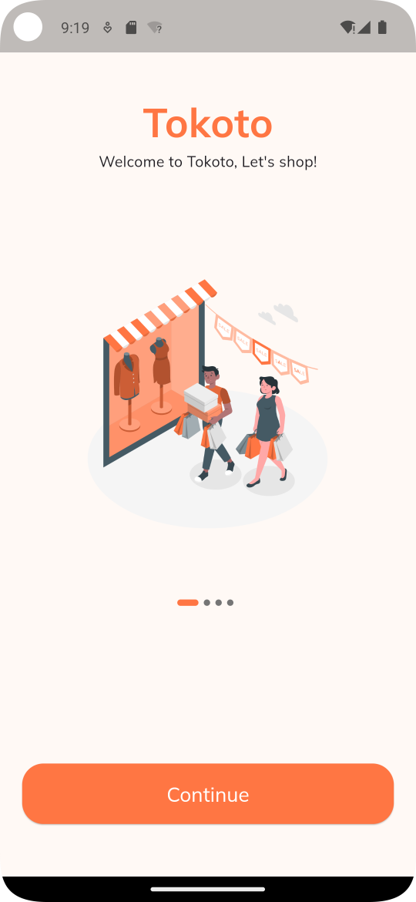
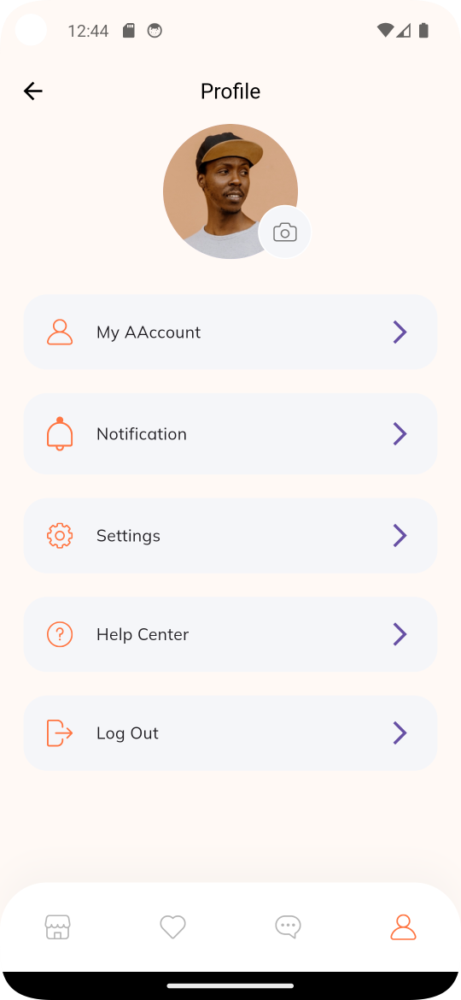

# E-Commerce Complete App - Flutter UI

Following a youtube tutorial series by The Flutter Way to get the basics of Flutter and Dart.
This is to learn how to build a complete e-commerce app, user interface, and user experience as well
as to learn
file structure, state management, and more.

### How we went about it:

- In the first part of our complete e-commerce app, we create a nice clean onboarding screen for
  your e-commerce app
- Then on the second part, we build a Sign in, Forgot Password screen with a custom error indicator.
- The third part, we create a Sign Up and OTP screen.
- The fourth part, the most exciting part because we build the home page on this part
- The fifth part we work on the product page,
- The sixth part we build an order screen which has some cool stuff like swipe to remove.
- At the end we build a profile screen.

You can watch the full tutorial on youtube
at [The Flutter Way](https://youtube.com/playlist?list=PLxUBb2A_UUy8OlaNZpS2mfL8xpHcnd_Af)

### Video Preview of Final UI

## Screens it contains:

- Onboarding
- Login
- Forgot Password
- Sign Up
- Complete Profile
- OTP Verification
- Home Page
- Product Details
- Order
- Profile
- Bottom Navigation Bar

## Photos

## Test the app on your device
[app-release.apk](build%2Fapp%2Foutputs%2Fflutter-apk%2Fapp-release.apk)